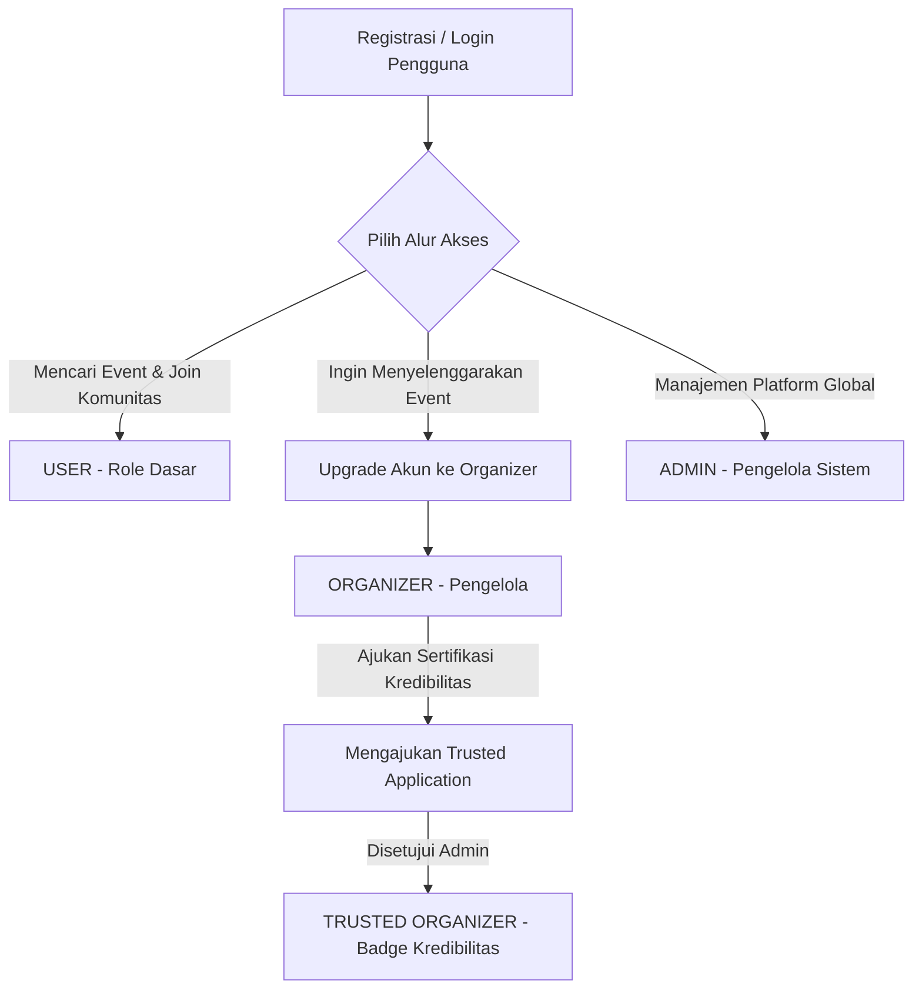
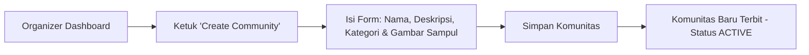

# PANDUAN PENGGUNA LENGKAP (USER MANUAL)
## Communitix - Community Event Management System

Selamat datang di Panduan Pengguna Resmi **Communitix**, platform manajemen event dan komunitas terintegrasi. Platform ini memfasilitasi komunikasi, kolaborasi, dan pengelolaan keanggotaan komunitas serta penyelenggaraan event dalam satu ekosistem digital.

Platform ini terdiri dari dua komponen utama:
1. **Aplikasi Mobile (Android)**: Frontend berbasis Kotlin dan Jetpack Compose dengan desain modern.
2. **Backend API (Laravel)**: Backend berbasis PHP Laravel yang menyediakan otentikasi berbasis Sanctum dan database relasional MySQL.

---

## DAFTAR ISI
1. [Gambaran Umum & Peran Pengguna (Roles)](#1-gambaran-umum--peran-pengguna-roles)
2. [Panduan Pengguna Umum (USER)](#2-panduan-pengguna-umum-user)
3. [Panduan Penyelenggara (ORGANIZER)](#3-panduan-penyelenggara-organizer)
4. [Panduan Administrator (ADMIN)](#4-panduan-administrator-admin)
5. [Struktur Data & Spesifikasi API (Teknis)](#5-struktur-data--spesifikasi-api-teknis)
6. [Pertanyaan yang Sering Diajukan (FAQ) & Troubleshooting](#6-pertanyaan-yang-sering-diajukan-faq--troubleshooting)

---

## 1. GAMBARAN UMUM & PERAN PENGGUNA (ROLES)

Communitix menggunakan sistem otentikasi terpusat dan membagi pengguna ke dalam 3 Peran (Role) utama, serta 1 Status Verifikasi Khusus:



### Tabel Peran dan Hak Akses

| Peran (Role) | Status Verifikasi | Hak Akses Utama | Deskripsi |
| :--- | :--- | :--- | :--- |
| **USER** | Biasa | Baca & Interaksi Sosial | Pendaftaran akun, bergabung dengan komunitas, mendaftar event, mengirim chat di forum komunitas, menandai event tersimpan, dan memberikan rating ulasan event. |
| **ORGANIZER** | Biasa / Pending | Manajemen Komunitas & Event | Seluruh hak akses USER + membuat komunitas baru, membuat & mengedit event, mengunggah dokumentasi foto event, serta mengajukan verifikasi kredibilitas. |
| **TRUSTED ORGANIZER** | **Verified (is_trusted = true)** | Keunggulan Visibilitas & Prioritas | Seluruh hak akses ORGANIZER + status lencana centang biru (badge terpercaya) pada profil/komunitas untuk meningkatkan kepercayaan pendaftar. |
| **ADMIN** | Sistem Utama | Moderasi & Monitoring Global | Akses ke panel dashboard, melihat statistik pertumbuhan platform, memblokir/membuka blokir (block/unblock) pengguna, menyetujui/menolak pengajuan status "Trusted Organizer". |

---

## 2. PANDUAN PENGGUNA UMUM (USER)

Bagian ini menjelaskan langkah-langkah penggunaan aplikasi Communitix bagi pengguna biasa untuk menjelajah, mendaftar, dan berinteraksi.

### 2.1 Pendaftaran & Masuk Akun
1. **Pendaftaran (Register)**:
   * Buka aplikasi Communitix. Pada halaman login, pilih **Register**.
   * Isi Nama Lengkap, Email aktif, dan Kata Sandi (minimal 8 karakter).
   * Ketuk **Register**. Akun Anda akan dibuat dan Anda otomatis diarahkan ke halaman Beranda.
2. **Masuk (Login)**:
   * Masukkan Email dan Kata Sandi yang telah terdaftar.
   * Ketuk **Login**. 
   * Sistem akan menyimpan *Auth Token* secara aman agar Anda tidak perlu login berulang kali.

> [!WARNING]
> Jika akun Anda terdeteksi melanggar pedoman komunitas dan diblokir oleh Admin, saat mencoba login Anda akan menerima pesan error: **"Akun Anda telah diblokir."** dan akses masuk akan ditolak.

---

### 2.2 Menjelajahi Beranda (Home)
Halaman Beranda adalah pusat aktivitas Anda. Di sini Anda dapat melihat:
* **Kategori Event & Komunitas**: Kategori terpopuler (seperti Teknologi, Pendidikan, Olahraga, dll) untuk mempermudah pencarian.
* **Top Events**: Rekomendasi event terdekat atau terpopuler.
* **Top Communities**: Komunitas dengan anggota terbanyak yang dapat Anda ikuti.
* **Menu Navigasi Bawah (Bottom Bar)**: Akses cepat ke halaman Beranda, Jelajah Komunitas, Jelajah Event, Notifikasi, dan Profil.

---

### 2.3 Menemukan Komunitas & Event
Aplikasi menyediakan fitur pencarian dan penyaringan (filter) tingkat lanjut untuk menemukan komunitas atau event yang relevan:

```
+-------------------------------------------------+
|  [Q  Cari Event...]                     [Tune]  |  <-- Kolom Pencarian & Tombol Filter
+-------------------------------------------------+
| [Semua] [Teknologi] [Pendidikan] [Olahraga]...  |  <-- Chips Kategori
+-------------------------------------------------+
```

* **Pencarian**: Ketik kata kunci pada kolom pencarian di bagian atas layar untuk memfilter judul, deskripsi, atau lokasi.
* **Kategori**: Ketuk tombol chip kategori (misal: "Teknologi") untuk menampilkan event/komunitas yang berada di kategori tersebut secara instan.
* **Penyaringan Lanjutan (Filter Sheet)**:
   1. Ketuk ikon filter **[Tune]** di samping kolom pencarian.
   2. Pilih kategori spesifik.
   3. Pilih status event: **Upcoming** (Mendatang), **Ongoing** (Sedang Berjalan), atau **Completed** (Selesai).
   4. Urutkan berdasarkan: **Terbaru**, **Terlama**, atau **Peserta Terbanyak**.
   5. Ketuk **Show Results** untuk menerapkan filter.
   6. Ketuk **Reset** jika ingin mengembalikan pencarian ke pengaturan awal.

---

### 2.4 Bergabung dengan Komunitas
Untuk berinteraksi dengan sesama anggota, Anda harus bergabung dengan komunitas terkait terlebih dahulu:
1. Temukan dan pilih komunitas dari daftar.
2. Pada halaman detail komunitas, Anda akan melihat deskripsi, nama penyelenggara, jumlah anggota, serta daftar event yang diselenggarakan oleh komunitas tersebut.
3. Ketuk tombol **Join Community**.
4. Status Anda akan berubah menjadi anggota aktif, dan jumlah anggota komunitas tersebut akan bertambah secara real-time.

---

### 2.5 Menggunakan Forum Chatting Komunitas
Setelah menjadi anggota komunitas, Anda dapat masuk ke Forum Diskusi:
1. Masuk ke halaman detail komunitas yang telah Anda ikuti.
2. Ketuk tombol **Community Forum** (Forum Komunitas).
3. Halaman obrolan grup akan terbuka. Anda dapat membaca pesan dari anggota lain dan mengetik pesan baru pada kolom input obrolan di bagian bawah layar.
4. Ketuk tombol kirim **[Send]** untuk mengirim pesan Anda.

> [!NOTE]
> Forum Chat ini menggunakan sistem real-time untuk memastikan setiap pesan baru langsung muncul pada layar pengguna lain tanpa harus memuat ulang (refresh) halaman.

---

### 2.6 Mendaftar & Partisipasi Event
Untuk menghadiri event yang diselenggarakan komunitas:
1. Pilih event yang ingin Anda ikuti (baik dari halaman Beranda, pencarian, atau halaman detail komunitas).
2. Tinjau tanggal, waktu, lokasi (apakah *Online* atau *Offline* di lokasi fisik), serta sisa kuota yang tersedia.
3. Ketuk tombol **Register Event**.
4. Sistem akan memvalidasi kuota. Jika kuota masih tersedia, status Anda akan langsung menjadi **REGISTERED** dan kuota peserta event akan berkurang secara otomatis.
5. Anda dapat melihat daftar event yang telah Anda daftari melalui menu **Saved Events** (Event Tersimpan) atau pada tab riwayat di halaman Profil Anda.

---

### 2.7 Memberikan Rating & Ulasan Event
Setelah Anda terdaftar dan menghadiri sebuah event yang telah selesai dilaksanakan (Status: *Past/Completed*):
1. Buka halaman detail event tersebut.
2. Anda akan melihat bagian **Ulasan & Rating**.
3. Pilih jumlah bintang dari 1 hingga 5.
4. Tulis ulasan singkat mengenai jalannya event tersebut pada kolom komentar yang disediakan.
5. Ketuk **Submit Rating**. Ulasan Anda akan disimpan dan terlihat oleh peserta lain serta penyelenggara event.

---

### 2.8 Mengelola Profil & Informasi Pengguna
Untuk mengakses dan memperbarui informasi diri:
1. Ketuk ikon **Profile** pada menu navigasi bawah.
2. Di sini Anda dapat melihat foto profil, nama, email, nomor telepon, bio singkat, gender, tanggal lahir, serta tombol khusus menuju dashboard sesuai peran Anda.
3. Ketuk **Edit Profile**:
   * Unggah/ubah foto profil Anda (maksimal ukuran berkas 2MB).
   * Edit nama, nomor telepon, jenis kelamin, tanggal lahir, dan tulis bio singkat Anda.
   * Ketuk **Save Changes** untuk memperbarui data ke server.

---

## 3. PANDUAN PENYELENGGARA (ORGANIZER)

Bagi Anda yang ingin mengelola komunitas sendiri dan menyelenggarakan event, berikut adalah panduan lengkapnya.

### 3.1 Upgrade Akun Menjadi Organizer
Secara default, akun baru terdaftar sebagai USER. Untuk mengaktifkan fitur pembuatan event dan komunitas, Anda harus menaikkan tingkat akun Anda:
1. Masuk ke halaman **Profile**.
2. Ketuk tombol **Register as Organizer** (Daftar Penyelenggara).
3. Anda akan diminta untuk membaca panduan penyelenggara, lalu ketuk tombol konfirmasi **Upgrade Account**.
4. Sistem akan memperbarui peran Anda secara instan dari `USER` menjadi `ORGANIZER`. Tombol **Organizer Dashboard** kini akan muncul di halaman Profil Anda.

---

### 3.2 Membuat & Mengelola Komunitas
Sebagai Organizer, Anda memiliki otoritas penuh untuk membuat komunitas baru:



1. Masuk ke **Organizer Dashboard** melalui menu Profil Anda.
2. Ketuk tombol **Create Community** (Buat Komunitas).
3. Isi data komunitas:
   * **Nama Komunitas**: Nama unik komunitas Anda.
   * **Kategori**: Pilih kategori industri/topik yang paling sesuai (misal: *Teknologi*).
   * **Deskripsi**: Penjelasan detail mengenai visi, misi, dan aktivitas komunitas Anda.
   * **Cover Image URL**: Masukkan URL gambar sampul berkualitas tinggi.
4. Ketuk **Submit**. Komunitas Anda sekarang aktif dan dapat ditemukan oleh seluruh pengguna platform.
5. **Mengedit Komunitas**:
   * Masuk ke halaman detail komunitas Anda.
   * Ketuk tombol **Edit Community** (Ikon Pensil).
   * Ubah data yang diperlukan, lalu simpan perubahan.

---

### 3.3 Membuat & Mengedit Event
Setiap event harus berada di bawah naungan suatu komunitas yang Anda kelola:
1. Masuk ke **Organizer Dashboard** atau halaman detail komunitas Anda.
2. Ketuk tombol **Create Event** (Buat Event).
3. Lengkapi formulir pembuatan event:
   * **Judul Event**: Nama event Anda.
   * **Kategori**: Pilih kategori event.
   * **Deskripsi Lengkap**: Detail agenda, pemateri, dan informasi penting lainnya.
   * **Tanggal & Waktu**: Tentukan tanggal pelaksanaan (YYYY-MM-DD) dan jam mulai (HH:MM).
   * **Jenis Pelaksanaan**: Pilih opsi *Online* (berupa link streaming/meeting) atau *Offline* (lokasi fisik).
   * **Lokasi**: Masukkan alamat fisik (jika *Offline*) atau tautan link rapat virtual seperti Zoom/Google Meet (jika *Online*).
   * **Kuota Maksimal (Max Attendees)**: Batas jumlah pendaftar (isi 0 jika tidak terbatas).
   * **Cover Image URL**: Tautan poster atau banner event.
4. Ketuk **Publish Event**. Event akan terdaftar dan siap menerima registrasi peserta.

---

### 3.4 Mengunggah Galeri Dokumentasi Event
Untuk event yang sedang berlangsung atau telah selesai, Anda dapat mengunggah foto dokumentasi:
1. Masuk ke halaman detail event yang Anda selenggarakan.
2. Cari bagian **Dokumentasi Event**.
3. Pilih opsi **Upload Image**:
   * Anda bisa memilih file gambar lokal dari penyimpanan handphone Anda (tipe berkas JPG/PNG/WEBP, maksimal ukuran 2MB).
   * Atau, Anda dapat menempelkan tautan URL gambar secara langsung.
4. Ketuk **Upload**. Gambar dokumentasi akan langsung muncul pada galeri event dan dapat dilihat oleh publik.

---

### 3.5 Mengajukan Status Terpercaya (Trusted Organizer)
Untuk meyakinkan calon peserta bahwa komunitas dan event Anda berkualitas dan aman (khususnya untuk event berskala besar), Anda dapat mengajukan permohonan status **Trusted Organizer**:
1. Masuk ke halaman **Profile**.
2. Ketuk tombol **Apply for Trusted Status** (Ajukan Status Terpercaya).
3. Isi formulir pengajuan dengan matang:
   * **Nama Komunitas Utama**: Komunitas utama yang Anda kelola.
   * **Alasan Pengajuan**: Mengapa komunitas Anda layak mendapatkan verifikasi (contoh: untuk meningkatkan keamanan registrasi).
   * **Pengalaman Penyelenggaraan**: Portofolio singkat event-event yang pernah Anda selenggarakan sebelumnya.
4. Ketuk **Submit Application**.
5. Status pengajuan Anda akan menjadi **PENDING**. 
6. Silakan pantau berkala halaman ini. Jika disetujui oleh Administrator, status akan berubah menjadi **APPROVED** dan akun Anda akan mendapatkan lencana verifikasi centang biru di seluruh platform. Jika ditolak, Anda dapat melihat **Admin Notes** (Catatan Admin) untuk mengetahui alasannya.

---

## 4. PANDUAN ADMINISTRATOR (ADMIN)

Bagian ini ditujukan bagi Administrator utama platform untuk memoderasi konten dan meninjau pengajuan.

### 4.1 Dashboard Utama & Statistik Global
1. Masuk ke aplikasi menggunakan akun dengan kredensial Administrator.
2. Di halaman Profil, pilih **Admin Dashboard**.
3. Di dashboard utama ini, Admin dapat memantau indikator kinerja utama platform secara real-time:
   * **Total Pengguna**: Jumlah seluruh pengguna yang terdaftar di platform.
   * **Total Komunitas**: Jumlah seluruh komunitas aktif.
   * **Total Event**: Jumlah seluruh event (mendatang, sedang berlangsung, dan selesai).
   * **Pertumbuhan Mingguan/Bulanan**: Grafik tren pendaftaran pengguna baru.

---

### 4.2 Manajemen & Moderasi Pengguna
Jika ada pengguna yang dilaporkan membagikan pesan spam, pelecehan di forum, atau menyelenggarakan event fiktif, Admin dapat mengambil tindakan pemblokiran:
1. Di **Admin Dashboard**, pilih tab **Users** (Pengguna).
2. Gunakan kolom pencarian untuk mencari pengguna berdasarkan nama atau alamat email.
3. Ketuk nama pengguna untuk melihat profil lengkap dan riwayat aktivitas mereka.
4. **Memblokir Pengguna (Block)**:
   * Ketuk tombol merah **Block User**.
   * Konfirmasi pemblokiran. Status pengguna akan berubah menjadi `is_blocked = true`. Pengguna tersebut akan dikeluarkan dari aplikasi secara otomatis dan tidak akan bisa masuk kembali menggunakan email tersebut.
5. **Membuka Blokir (Unblock)**:
   * Jika masa hukuman pengguna telah selesai, Admin dapat mencari akun tersebut kembali di daftar pengguna yang terblokir.
   * Ketuk tombol hijau **Unblock User** untuk memulihkan hak akses akun.

---

### 4.3 Meninjau Pengajuan Trusted Organizer
Semua berkas permohonan dari para penyelenggara akan masuk ke daftar antrean review Admin:
1. Di **Admin Dashboard**, pilih tab **Trusted Applications** (Pengajuan Terpercaya).
2. Anda akan melihat daftar permohonan dengan status **PENDING**:
   * Nama Organizer pemohon.
   * Nama Komunitas.
   * Alasan & Pengalaman Penyelenggara.

```
+-------------------------------------------------------------+
| Pengaju: Alex Organizer                                     |
| Komunitas: Android Developers Bandung                       |
| Status: [ PENDING ]                                         |
|-------------------------------------------------------------|
| Catatan Admin: [ Tulis alasan persetujuan/penolakan...   ]  |
|                                                             |
|           [ SETUJUI (APPROVE) ]     [ TOLAK (REJECT) ]      |
+-------------------------------------------------------------+
```

3. Baca dan verifikasi portofolio mereka.
4. Ketik catatan evaluasi pada kolom **Admin Notes** (Catatan keputusan ini akan terlihat oleh pemohon).
5. **Menyetujui (Approve)**:
   * Ketuk **Approve**. Sistem akan mengubah status permohonan menjadi `APPROVED`, otomatis mengubah nilai kolom `is_trusted` milik user tersebut menjadi `true`, dan mengirimkan notifikasi sukses ke akun user terkait.
6. **Menolak (Reject)**:
   * Ketuk **Reject**. Status permohonan menjadi `REJECTED`, flag `is_trusted` tetap `false`, dan notifikasi penolakan beserta alasan catatan Admin akan dikirim ke user tersebut.

---

## 5. STRUKTUR DATA & SPESIFIKASI API (TEKNIS)

Untuk keperluan pengembangan dan pemeliharaan lanjutan sistem, berikut adalah ringkasan teknis API dan Database.

### 5.1 Format Otentikasi
Seluruh endpoint yang dilindungi (protected) menggunakan skema otentikasi Bearer Token via **Laravel Sanctum**. Token harus disisipkan pada header HTTP di setiap request:
```http
Authorization: Bearer <token_akses_anda>
Accept: application/json
```

### 5.2 Kode Respons & Solusi
* **`200 OK` / `201 Created`**: Request berhasil diproses.
* **`401 Unauthorized`**: Token kedaluwarsa atau tidak valid. Solusi: Arahkan pengguna kembali ke halaman Login untuk mendapatkan token baru.
* **`403 Forbidden`**: Pengguna tidak memiliki hak akses (misal: user biasa mengakses admin panel, atau akun diblokir). Solusi: Tampilkan dialog peringatan akses ditolak.
* **`422 Unprocessable Content`**: Input tidak lolos validasi server (misal: format email salah, password kurang dari 8 karakter). Solusi: Tampilkan pesan error spesifik di bawah text field yang bermasalah.
* **`500 Internal Server Error`**: Masalah pada server/database. Solusi: Minta pengguna mencoba lagi setelah beberapa saat.

---

## 6. PERTANYAAN YANG SERING DIAJUKAN (FAQ) & TROUBLESHOOTING

#### Q: Mengapa saya tidak bisa masuk ke Forum Chat Komunitas?
**A**: Pastikan Anda telah bergabung sebagai anggota komunitas tersebut dengan mengetuk tombol **Join Community**. Hanya anggota resmi terdaftar yang memiliki otorisasi untuk membaca dan mengirim pesan forum chat.

#### Q: Mengapa saya gagal mendaftar ke Event?
**A**: Hal ini biasanya terjadi karena dua alasan:
1. Kuota event sudah penuh (*max attendees* tercapai). Anda dapat melihat tulisan kuota pada kartu event.
2. Anda sudah terdaftar sebelumnya di event tersebut. Periksa menu **Saved Events** Anda.

#### Q: Bagaimana cara mengganti Foto Profil atau Gambar Sampul Event?
**A**: Pastikan ukuran berkas gambar yang Anda pilih dari galeri handphone tidak melebihi **2 Megabyte (2048 KB)** dan memiliki ekstensi format `.jpg`, `.jpeg`, `.png`, atau `.webp`. Unggahan dengan file di luar kriteria tersebut akan ditolak oleh server demi menghemat kuota bandwidth.

#### Q: Saya tidak menerima Notifikasi Push di handphone saya.
**A**: Pastikan aplikasi Communitix diberikan izin notifikasi pada pengaturan sistem operasi Android Anda (Settings > Apps > Communitix > Notifications > Allow). Platform menggunakan Firebase Cloud Messaging (FCM) untuk mendistribusikan notifikasi secara instan.

---

> [!NOTE]
> Panduan ini diperbarui secara berkala mengikuti pengembangan fitur Communitix. Jika Anda mengalami kendala teknis lebih lanjut yang tidak tercantum dalam panduan ini, silakan hubungi tim dukungan IT Communitix melalui menu Masukan di halaman profil aplikasi.
