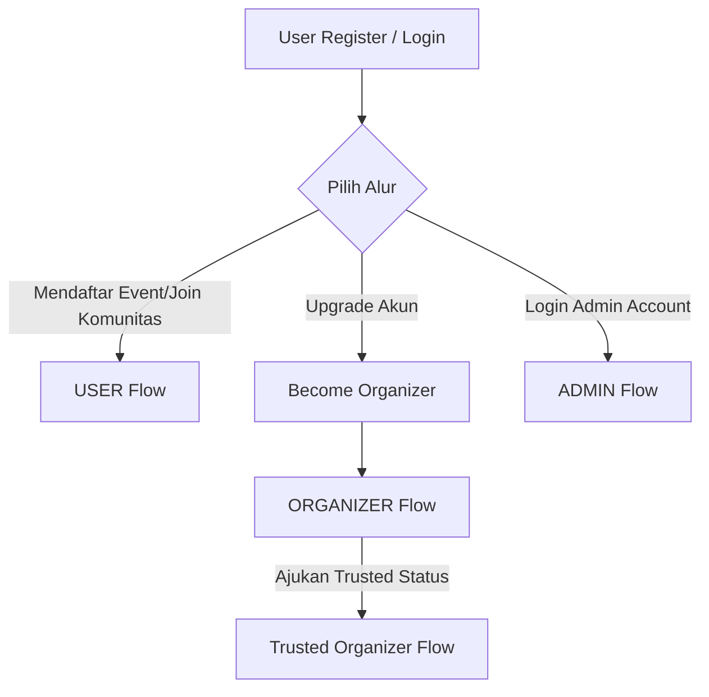

# Dokumentasi Lengkap API Backend - Community Event Management

Dokumentasi ini ditulis sebagai panduan integrasi bagi **Android Developer** untuk aplikasi **Community Event Management**. Seluruh endpoint menggunakan Laravel Sanctum untuk autentikasi dan database relasional untuk persistensi data.

---

## 1. Pendahuluan & Alur Bisnis (User Flows)

### Tujuan Project
Aplikasi Community Event Management adalah platform digital yang memfasilitasi komunitas dalam mengelola keanggotaan mereka, merencanakan, mendistribusikan, dan mendaftarkan anggota ke berbagai event, serta memfasilitasi komunikasi melalui forum komunitas.

### Role & Status Keanggotaan
1. **USER (Role Dasar)**: Pengguna umum yang baru mendaftar. Dapat bergabung ke komunitas, mendaftar ke event, mengirim pesan di forum, melihat notifikasi, dan memberi rating event yang diikuti.
2. **ORGANIZER**: Pengguna yang berwenang membuat komunitas dan mengelola event di dalam komunitas tersebut. Pengguna dapat naik kelas dari `USER` menjadi `ORGANIZER` secara instan menggunakan endpoint upgrade.
3. **ADMIN**: Pengelola platform tingkat tinggi yang memantau statistik, memblokir/membuka blokir pengguna, serta meninjau permohonan status "Trusted Organizer".
4. **is_trusted (Status Verifikasi)**: Flag boolean khusus (`true`/`false`) pada akun `ORGANIZER` untuk menandakan status terverifikasi (Trusted Organizer) setelah disetujui oleh Admin melalui proses pengajuan.



### Detil Alur Pengguna (User Flows)

#### A. Alur User (Flow User)
1. **Registrasi/Login**: Pengguna mendaftar atau masuk untuk mendapatkan Token Autentikasi.
2. **Jelajahi Komunitas**: Mencari komunitas berdasarkan kata kunci atau kategori.
3. **Bergabung dengan Komunitas**: User bergabung dengan komunitas (`join`) untuk menjadi anggota aktif.
4. **Mendaftar Event**: User melihat daftar event mendatang, lalu mendaftar ke event.
5. **Aktivitas Event & Forum**: Mengirim pesan di forum komunitas, mengunggah rating event setelah terdaftar.
6. **Menerima Notifikasi**: Mendapatkan update tentang status pendaftaran event dan pesan baru.

#### B. Alur Organizer (Flow Organizer)
1. **Upgrade Role**: User biasa memanggil `/api/become-organizer` untuk berganti role menjadi `ORGANIZER`.
2. **Buat Komunitas**: Organizer membuat komunitas baru dengan kategori tertentu.
3. **Kelola Event**: Membuat event di bawah komunitas miliknya, menentukan kuota, tanggal, waktu, lokasi, dan status online/offline.
4. **Update/Hapus Data**: Memperbarui detail komunitas atau event, dan mengunggah gambar pendukung event.

#### C. Alur Trusted Organizer (Flow Trusted Organizer)
1. **Pengajuan**: Organizer yang aktif mengajukan permohonan verifikasi melalui POST `/api/trusted-applications` dengan menyertakan nama komunitas, alasan, dan pengalaman.
2. **Review Admin**: Menunggu peninjauan admin. Status aplikasi berubah menjadi `PENDING` -> `APPROVED` atau `REJECTED`.
3. **Mendapatkan Badge**: Jika disetujui, flag `is_trusted` diatur ke `true` dan pengguna berstatus sebagai Trusted Organizer.

#### D. Alur Admin (Flow Admin)
1. **Monitoring Dashboard**: Membuka dashboard statistik keseluruhan (jumlah user, komunitas, event, dll).
2. **Moderasi User**: Memblokir pengguna bermasalah (block) agar tidak bisa login, atau membuka kembali blokir (unblock).
3. **Review Trusted Applications**: Meninjau permohonan Trusted Organizer dari para organizer, memberikan catatan keputusan (`admin_notes`), lalu menyetujui atau menolaknya.

---

## 2. Sistem Autentikasi: Laravel Sanctum

Backend ini menggunakan **Laravel Sanctum** untuk menangani otentikasi berbasis token API sederhana yang aman untuk perangkat mobile.

### Cara Login & Mendapatkan Token
1. Lakukan request **POST** ke `/api/login` atau `/api/register` dengan mengirimkan email dan password.
2. Jika berhasil, backend mengembalikan objek JSON berisi data profil user dan sebuah string token di dalam properti `"token"`.
3. Simpan string token ini secara aman di penyimpanan lokal Android (sangat direkomendasikan menggunakan `EncryptedSharedPreferences`).

### Cara Menggunakan Authorization Header
Untuk setiap request ke endpoint yang memerlukan autentikasi (`auth:sanctum`), Anda **wajib** menyertakan token tersebut dalam header HTTP dengan format berikut:

```http
Authorization: Bearer <TOKEN>
```

**Contoh Request Header:**
```http
GET /api/profile HTTP/1.1
Host: communityapp-backend.test
Authorization: Bearer 3|abcde1234567890fghijklmnopqrstuvwxyz
Accept: application/json
```

---

## 3. Skema Database (Database Schema)

Berikut adalah daftar seluruh tabel yang tersedia di database, tipe data, properti nullable, dan relasi antartabel yang digunakan sebagai *source of truth*.

### 1. users
Menyimpan data akun pengguna, role, dan status verifikasi/pemblokiran.
* **id**: `bigint unsigned` | `NOT NULL` | Primary Key, Auto Increment
* **name**: `varchar(255)` | `NOT NULL`
* **phone_number**: `varchar(255)` | `NULL`
* **email**: `varchar(255)` | `NOT NULL` | Unique
* **password**: `varchar(255)` | `NOT NULL`
* **gender**: `varchar(255)` | `NULL`
* **bio**: `text` | `NULL`
* **birth_date**: `date` | `NULL`
* **avatar_url**: `varchar(255)` | `NULL`
* **email_verified_at**: `timestamp` | `NULL`
* **role**: `enum('ADMIN','USER','ORGANIZER')` | `NOT NULL` | Default: `USER`
* **is_blocked**: `boolean` | `NOT NULL` | Default: `false`
* **is_trusted**: `boolean` | `NOT NULL` | Default: `false`
* **remember_token**: `varchar(100)` | `NULL`
* **created_at**: `timestamp` | `NULL`
* **updated_at**: `timestamp` | `NULL`
* **Relasi**:
  * One-to-Many ke `communities` (Sebagai pembuat/organizer)
  * One-to-Many ke `community_members` (Keterlibatan keanggotaan)
  * One-to-Many ke `event_registrations` (Event yang diikuti)
  * One-to-Many ke `event_ratings` (Ulasan event)
  * One-to-Many ke `forum_messages` (Pesan obrolan forum)
  * One-to-Many ke `event_images` (Foto event yang diunggah)
  * One-to-Many ke `notifications` (Notifikasi milik user)
  * One-to-One ke `trusted_applications` (Pengajuan verifikasi)

### 2. categories
Kategori dari komunitas dan event (contoh: Pendidikan, Teknologi, Olahraga).
* **id**: `bigint unsigned` | `NOT NULL` | Primary Key, Auto Increment
* **name**: `varchar(255)` | `NOT NULL`
* **icon**: `varchar(255)` | `NULL`
* **created_at**: `timestamp` | `NULL`
* **updated_at**: `timestamp` | `NULL`
* **Relasi**:
  * One-to-Many ke `communities`
  * One-to-Many ke `events`

### 3. communities
Tabel komunitas yang dibuat oleh Organizer.
* **id**: `bigint unsigned` | `NOT NULL` | Primary Key, Auto Increment
* **name**: `varchar(255)` | `NOT NULL`
* **organizer_id**: `bigint unsigned` | `NOT NULL` | Foreign Key -> `users(id)` (On Delete Cascade)
* **category_id**: `bigint unsigned` | `NOT NULL` | Foreign Key -> `categories(id)` (On Delete Cascade)
* **description**: `text` | `NOT NULL`
* **status**: `enum('ACTIVE','INACTIVE')` | `NOT NULL` | Default: `ACTIVE`
* **cover_image_url**: `text` | `NULL`
* **member_count**: `integer` | `NOT NULL` | Default: `0`
* **created_at**: `timestamp` | `NULL`
* **updated_at**: `timestamp` | `NULL`
* **Relasi**:
  * BelongsTo `users` (Lewat `organizer_id`)
  * BelongsTo `categories` (Lewat `category_id`)
  * One-to-Many ke `community_members`
  * One-to-Many ke `events`
  * One-to-Many ke `forum_messages`

### 4. community_members
Tabel pivot keanggotaan user di dalam komunitas.
* **id**: `bigint unsigned` | `NOT NULL` | Primary Key, Auto Increment
* **user_id**: `bigint unsigned` | `NOT NULL` | Foreign Key -> `users(id)` (On Delete Cascade)
* **community_id**: `bigint unsigned` | `NOT NULL` | Foreign Key -> `communities(id)` (On Delete Cascade)
* **role**: `enum('OWNER','MODERATOR','MEMBER')` | `NOT NULL` | Default: `MEMBER`
* **joined_at**: `timestamp` | `NOT NULL` | Default: CURRENT_TIMESTAMP
* **created_at**: `timestamp` | `NULL`
* **updated_at**: `timestamp` | `NULL`
* **Constraint**: Unique (`user_id`, `community_id`)
* **Relasi**:
  * BelongsTo `users`
  * BelongsTo `communities`

### 5. events
Event-event yang diadakan di dalam suatu komunitas.
* **id**: `bigint unsigned` | `NOT NULL` | Primary Key, Auto Increment
* **community_id**: `bigint unsigned` | `NOT NULL` | Foreign Key -> `communities(id)` (On Delete Cascade)
* **category_id**: `bigint unsigned` | `NOT NULL` | Foreign Key -> `categories(id)` (On Delete Cascade)
* **title**: `varchar(255)` | `NOT NULL`
* **description**: `text` | `NOT NULL`
* **event_date**: `date` | `NOT NULL`
* **event_time**: `time` | `NOT NULL`
* **location**: `varchar(255)` | `NOT NULL`
* **is_online**: `boolean` | `NOT NULL` | Default: `false`
* **max_attendees**: `integer` | `NOT NULL` | Default: `0` (0 berarti tidak terbatas)
* **attendee_count**: `integer` | `NOT NULL` | Default: `0`
* **cover_image_url**: `text` | `NULL`
* **status**: `enum('UPCOMING','ONGOING','PAST')` | `NOT NULL` | Default: `UPCOMING`
* **created_at**: `timestamp` | `NULL`
* **updated_at**: `timestamp` | `NULL`
* **Relasi**:
  * BelongsTo `communities`
  * BelongsTo `categories`
  * One-to-Many ke `event_registrations`
  * One-to-Many ke `event_images`
  * One-to-Many ke `event_ratings`

### 6. event_registrations
Pendaftaran user ke event tertentu beserta status kehadiran atau pembatalan.
* **id**: `bigint unsigned` | `NOT NULL` | Primary Key, Auto Increment
* **user_id**: `bigint unsigned` | `NOT NULL` | Foreign Key -> `users(id)` (On Delete Cascade)
* **event_id**: `bigint unsigned` | `NOT NULL` | Foreign Key -> `events(id)` (On Delete Cascade)
* **status**: `enum('REGISTERED','ATTENDED','CANCELLED')` | `NOT NULL` | Default: `REGISTERED`
* **registered_at**: `timestamp` | `NOT NULL` | Default: CURRENT_TIMESTAMP
* **attended_at**: `timestamp` | `NULL`
* **created_at**: `timestamp` | `NULL`
* **updated_at**: `timestamp` | `NULL`
* **Constraint**: Unique (`user_id`, `event_id`)
* **Relasi**:
  * BelongsTo `users`
  * BelongsTo `events`

### 7. event_images
Foto/gambar dokumentasi yang diupload untuk suatu event.
* **id**: `bigint unsigned` | `NOT NULL` | Primary Key, Auto Increment
* **event_id**: `bigint unsigned` | `NOT NULL` | Foreign Key -> `events(id)` (On Delete Cascade)
* **uploaded_by**: `bigint unsigned` | `NULL` | Foreign Key -> `users(id)` (On Delete Null)
* **image_url**: `text` | `NOT NULL`
* **created_at**: `timestamp` | `NULL`
* **updated_at**: `timestamp` | `NULL`
* **Relasi**:
  * BelongsTo `events`
  * BelongsTo `users` (Sebagai uploader)

### 8. event_ratings
Rating dan ulasan singkat dari user yang telah terdaftar di event tersebut.
* **id**: `bigint unsigned` | `NOT NULL` | Primary Key, Auto Increment
* **user_id**: `bigint unsigned` | `NOT NULL` | Foreign Key -> `users(id)` (On Delete Cascade)
* **event_id**: `bigint unsigned` | `NOT NULL` | Foreign Key -> `events(id)` (On Delete Cascade)
* **rating**: `tinyint unsigned` | `NOT NULL` | CHECK (rating >= 1 AND rating <= 5)
* **comment**: `text` | `NULL`
* **created_at**: `timestamp` | `NULL`
* **updated_at**: `timestamp` | `NULL`
* **Constraint**: Unique (`user_id`, `event_id`)
* **Relasi**:
  * BelongsTo `users`
  * BelongsTo `events`

### 9. forum_messages
Pesan obrolan (chatting) antar anggota dalam forum komunitas.
* **id**: `bigint unsigned` | `NOT NULL` | Primary Key, Auto Increment
* **community_id**: `bigint unsigned` | `NOT NULL` | Foreign Key -> `communities(id)` (On Delete Cascade)
* **sender_id**: `bigint unsigned` | `NOT NULL` | Foreign Key -> `users(id)` (On Delete Cascade)
* **message**: `text` | `NOT NULL`
* **created_at**: `timestamp` | `NULL`
* **updated_at**: `timestamp` | `NULL`
* **deleted_at**: `timestamp` | `NULL` (Soft Delete)
* **Relasi**:
  * BelongsTo `communities`
  * BelongsTo `users` (Sebagai sender)

### 10. notifications
Sistem notifikasi internal untuk memberikan update status aplikasi ke user.
* **id**: `bigint unsigned` | `NOT NULL` | Primary Key, Auto Increment
* **user_id**: `bigint unsigned` | `NOT NULL` | Foreign Key -> `users(id)` (On Delete Cascade)
* **title**: `varchar(255)` | `NOT NULL`
* **message**: `text` | `NOT NULL`
* **type**: `enum('EVENT','COMMUNITY','TRUSTED_APPLICATION','SYSTEM')` | `NOT NULL`
* **is_read**: `boolean` | `NOT NULL` | Default: `false`
* **reference_type**: `varchar(255)` | `NULL` (misal: 'App\Models\Event')
* **reference_id**: `bigint unsigned` | `NULL`
* **created_at**: `timestamp` | `NULL`
* **updated_at**: `timestamp` | `NULL`
* **Relasi**:
  * BelongsTo `users`

### 11. trusted_applications
Formulir pengajuan verifikasi dari Organizer untuk mendapatkan status Trusted.
* **id**: `bigint unsigned` | `NOT NULL` | Primary Key, Auto Increment
* **user_id**: `bigint unsigned` | `NOT NULL` | Foreign Key -> `users(id)` (On Delete Cascade) | Unique
* **community_name**: `varchar(255)` | `NOT NULL`
* **reason**: `text` | `NOT NULL`
* **experience**: `text` | `NULL`
* **status**: `enum('PENDING','APPROVED','REJECTED')` | `NOT NULL` | Default: `PENDING`
* **reviewed_by**: `bigint unsigned` | `NULL` | Foreign Key -> `users(id)`
* **admin_notes**: `text` | `NULL`
* **applied_at**: `timestamp` | `NOT NULL` | Default: CURRENT_TIMESTAMP
* **reviewed_at**: `timestamp` | `NULL`
* **created_at**: `timestamp` | `NULL`
* **updated_at**: `timestamp` | `NULL`
* **Relasi**:
  * BelongsTo `users` (Sebagai pemohon lewat `user_id`)
  * BelongsTo `users` (Sebagai admin reviewer lewat `reviewed_by`)

---

## 4. Otorisasi Endpoint Berdasarkan Role

Berikut adalah daftar pembagian endpoint berdasarkan peran (role) yang dibutuhkan untuk mengaksesnya:

| Role Pengguna | Endpoint Tambahan yang Dapat Diakses | Deskripsi Hak Akses |
| :--- | :--- | :--- |
| **Tamu (No Auth)** | `POST /api/register`<br>`POST /api/login` | Registrasi dan masuk aplikasi. |
| **USER (Authenticated)** | Semua endpoint publik & user dasar seperti:<br>- `GET /api/profile` & `PUT /api/profile`<br>- `POST /api/profile/avatar`<br>- `GET /api/categories`<br>- `GET /api/communities` & `POST /api/communities/{c}/join`<br>- `GET /api/events` & `POST /api/events/{e}/register`<br>- `POST /api/events/{e}/ratings`<br>- `GET /api/communities/{c}/messages` & `POST /api/communities/{c}/messages`<br>- `POST /api/become-organizer` | Menjelajahi platform, mendaftar event, bergabung komunitas, dan berinteraksi di forum. |
| **ORGANIZER** | Semua hak akses **USER** plus:<br>- `POST /api/communities` (Membuat komunitas)<br>- `POST /api/events` (Membuat event pada komunitas miliknya)<br>- `PUT/PATCH/DELETE /api/communities/{c}` (Mengedit/Menghapus komunitas miliknya)<br>- `PUT/PATCH/DELETE /api/events/{e}` (Mengedit/Menghapus event miliknya)<br>- `POST /api/events/{e}/images` (Mengupload dokumentasi foto event)<br>- `POST /api/trusted-applications` (Mengajukan Trusted status) | Manajemen siklus komunitas dan event miliknya sendiri. |
| **ADMIN** | Semua hak akses **USER** & **ORGANIZER** plus:<br>- `GET /api/admin/dashboard` (Statistik dashboard)<br>- `GET /api/admin/users` (Daftar user platform)<br>- `POST /api/admin/users/{user}/block` & `unblock`<br>- `GET /api/admin/trusted-applications` (Daftar pengajuan)<br>- `POST /api/admin/trusted-applications/{id}/approve` & `reject` | Moderasi platform global, pemblokiran akun, dan verifikasi Trusted Organizer. |

---

## 5. Parameter Query & Fitur Pencarian

Dua endpoint pencarian utama (`GET /api/communities` dan `GET /api/events`) menerima query parameter untuk memfilter data pada perangkat mobile.

### GET /api/communities
Menerima filter:
* `search` (String): Mencari nama komunitas atau deskripsi komunitas (`like %search%`).
* `category_id` (Integer): Menyaring komunitas berdasarkan kecocokan ID kategori.
* `page` (Integer): Halaman data paginasi yang ingin dimuat (default: 1).

### GET /api/events
Menerima filter:
* `search` (String): Mencari judul, deskripsi, atau lokasi event (`like %search%`).
* `category_id` (Integer): Menyaring event berdasarkan kecocokan ID kategori.
* `status` (String): Menyaring status event (`UPCOMING`, `ONGOING`, atau `PAST`).
* `page` (Integer): Halaman data paginasi yang ingin dimuat (default: 1).

---

## 6. Format Response Paginasi Laravel

Laravel mengembalikan data relasional dalam format paginasi terstandarisasi untuk memotong muatan data yang besar. Android Developer wajib memetakan wrapper paginasi ini ke dalam model DTO.

### Struktur JSON Lengkap Paginasi
```json
{
  "current_page": 1,
  "data": [
    {
      "id": 1,
      "name": "Android Developers Bandung",
      "organizer_id": 2,
      "category_id": 1,
      "description": "Kumpulan pengembang aplikasi Android daerah Bandung dan sekitarnya.",
      "status": "ACTIVE",
      "cover_image_url": "https://example.com/storage/covers/android-bdg.png",
      "member_count": 42,
      "created_at": "2026-06-11T06:56:42.000000Z",
      "updated_at": "2026-06-11T06:56:42.000000Z",
      "organizer": {
        "id": 2,
        "name": "Alex Organizer",
        "email": "alex@example.com",
        "role": "ORGANIZER",
        "is_trusted": true
      },
      "category": {
        "id": 1,
        "name": "Teknologi",
        "icon": "code-braces"
      }
    }
  ],
  "first_page_url": "http://communityapp-backend.test/api/communities?page=1",
  "from": 1,
  "last_page": 5,
  "last_page_url": "http://communityapp-backend.test/api/communities?page=5",
  "links": [
    {
      "url": null,
      "label": "&laquo; Previous",
      "active": false
    },
    {
      "url": "http://communityapp-backend.test/api/communities?page=1",
      "label": "1",
      "active": true
    },
    {
      "url": "http://communityapp-backend.test/api/communities?page=2",
      "label": "Next &raquo;",
      "active": false
    }
  ],
  "next_page_url": "http://communityapp-backend.test/api/communities?page=2",
  "path": "http://communityapp-backend.test/api/communities",
  "per_page": 10,
  "prev_page_url": null,
  "to": 1,
  "total": 50
}
```

---

## 7. Penanganan Berkas (File Uploads)

Proses unggah berkas dilakukan dengan tipe Request **`multipart/form-data`**. Token Authorization Bearer tetap wajib disertakan pada Header.

### A. Avatar Upload (`POST /api/profile/avatar`)
* **Content-Type**: `multipart/form-data`
* **Field**:
  * `avatar`: (File) Harus berupa berkas gambar (`jpg`, `jpeg`, `png`, `webp`) dengan ukuran maksimum **2048 KB** (2MB).
* **Response**: Mengembalikan profil user terupdate dengan URL avatar baru di field `avatar_url`.

### B. Event Image Upload (`POST /api/events/{event}/images`)
* **Content-Type**: `multipart/form-data`
* **Field**:
  * `image`: (File, Optional) Gambar dokumentasi event (`jpg`, `jpeg`, `png`, `webp`, max 2MB).
  * `image_url`: (String, Optional) Mengirimkan link gambar mentah jika tidak mengunggah file lokal.
  * *Catatan*: Salah satu dari `image` atau `image_url` wajib dikirimkan (tidak boleh keduanya kosong).

---

## 8. Penanganan Kode Status HTTP (Error Responses)

Semua response error menggunakan kode status HTTP yang standar dengan pesan error terformat.

### 401 Unauthorized
Terjadi jika token kosong, salah format, atau sudah tidak berlaku.
```json
{
  "message": "Unauthenticated."
}
```

### 403 Forbidden
Terjadi jika user mencoba mengakses resource yang bukan miliknya (misal mengedit event komunitas lain), atau diblokir oleh Admin.
```json
{
  "message": "Anda tidak memiliki izin untuk mengubah event ini."
}
```
*Atau ketika akun diblokir saat login:*
```json
{
  "message": "Akun Anda telah diblokir."
}
```

### 404 Not Found
Terjadi jika ID model yang dicari tidak ada di database.
```json
{
  "message": "Record not found."
}
```

### 422 Validation Error
Terjadi jika input request tidak memenuhi syarat validasi server.
```json
{
  "message": "The email field is required. (and 1 more error)",
  "errors": {
    "email": [
      "The email field is required."
    ],
    "password": [
      "The password field must be at least 8 characters."
    ]
  }
}
```

### 500 Server Error
Terjadi jika terdapat kendala internal server database atau runtime error.
```json
{
  "message": "An internal server error occurred."
}
```

---

## 9. Detil Spesifikasi Endpoints

### 1. Register User Baru
* **Method**: `POST`
* **URL**: `/api/register`
* **Authentication Required**: `No`
* **Role Required**: `None`
* **Description**: Mendaftarkan akun user baru ke dalam sistem dan langsung mengembalikan token akses.
* **Validation Rules**:
  * `name`: `required|string|max:255`
  * `email`: `required|email|unique:users`
  * `password`: `required|min:8`
* **Request JSON**:
  ```json
  {
    "name": "Budi Santoso",
    "email": "budi@example.com",
    "password": "budipassword123"
  }
  ```
* **Response JSON (201 Created)**:
  ```json
  {
    "user": {
      "id": 5,
      "name": "Budi Santoso",
      "email": "budi@example.com",
      "role": "USER",
      "is_blocked": false,
      "is_trusted": false,
      "updated_at": "2026-06-11T06:56:42.000000Z",
      "created_at": "2026-06-11T06:56:42.000000Z"
    },
    "token": "1|qWerty123..."
  }
  ```
* **HTTP Status Code**: `201 Created` / `422 Unprocessable Content`

### 2. Login User
* **Method**: `POST`
* **URL**: `/api/login`
* **Authentication Required**: `No`
* **Role Required**: `None`
* **Description**: Melakukan otentikasi menggunakan email dan password untuk memperoleh token baru.
* **Validation Rules**:
  * `email`: `required|email`
  * `password`: `required`
* **Request JSON**:
  ```json
  {
    "email": "budi@example.com",
    "password": "budipassword123"
  }
  ```
* **Response JSON (200 OK)**:
  ```json
  {
    "user": {
      "id": 5,
      "name": "Budi Santoso",
      "email": "budi@example.com",
      "role": "USER",
      "is_blocked": false,
      "is_trusted": false,
      "created_at": "2026-06-11T06:56:42.000000Z",
      "updated_at": "2026-06-11T06:56:42.000000Z"
    },
    "token": "2|aSdfgh456..."
  }
  ```
* **HTTP Status Code**: `200 OK` / `401 Unauthorized` / `403 Forbidden (Blocked)` / `422 Unprocessable Content`

### 3. Buat Komunitas Baru
* **Method**: `POST`
* **URL**: `/api/communities`
* **Authentication Required**: `Yes (Bearer Token)`
* **Role Required**: `ORGANIZER` atau `ADMIN`
* **Description**: Membuat komunitas baru di dalam platform.
* **Validation Rules**:
  * `name`: `required|string|max:255`
  * `description`: `required|string`
  * `category_id`: `required|integer|exists:categories,id`
  * `cover_image_url`: `nullable|string`
* **Request JSON**:
  ```json
  {
    "name": "Komunitas UI/UX Design Jakarta",
    "description": "Tempat berkumpulnya desainer produk digital untuk belajar bersama.",
    "category_id": 2,
    "cover_image_url": "https://example.com/images/uiux-cover.png"
  }
  ```
* **Response JSON (201 Created)**:
  ```json
  {
    "id": 3,
    "name": "Komunitas UI/UX Design Jakarta",
    "organizer_id": 5,
    "category_id": 2,
    "description": "Tempat berkumpulnya desainer produk digital untuk belajar bersama.",
    "status": "ACTIVE",
    "cover_image_url": "https://example.com/images/uiux-cover.png",
    "member_count": 0,
    "created_at": "2026-06-11T06:56:42.000000Z",
    "updated_at": "2026-06-11T06:56:42.000000Z"
  }
  ```
* **HTTP Status Code**: `201 Created` / `403 Forbidden` / `422 Unprocessable Content`

### 4. Bergabung Komunitas (Join)
* **Method**: `POST`
* **URL**: `/api/communities/{community}/join`
* **Authentication Required**: `Yes (Bearer Token)`
* **Role Required**: `None` (Semua user terdaftar)
* **Description**: Menambahkan user yang sedang login menjadi anggota di komunitas tertentu.
* **Request**: Kosong (ID komunitas dikirim di URL path)
* **Response JSON (200 OK)**:
  ```json
  {
    "message": "Joined",
    "community": {
      "id": 3,
      "name": "Komunitas UI/UX Design Jakarta",
      "member_count": 1,
      "status": "ACTIVE"
    }
  }
  ```
* **HTTP Status Code**: `200 OK` / `400 Bad Request (Sudah bergabung)` / `404 Not Found`

### 5. Buat Event Baru
* **Method**: `POST`
* **URL**: `/api/events`
* **Authentication Required**: `Yes (Bearer Token)`
* **Role Required**: `ORGANIZER` atau `ADMIN` (Wajib pemilik komunitas terkait)
* **Description**: Membuat event baru dalam suatu komunitas.
* **Validation Rules**:
  * `community_id`: `required|integer|exists:communities,id`
  * `category_id`: `required|integer|exists:categories,id`
  * `title`: `required|string|max:255`
  * `description`: `required|string`
  * `event_date`: `required|date`
  * `event_time`: `required|date_format:H:i`
  * `location`: `required|string|max:255`
  * `is_online`: `sometimes|boolean`
  * `max_attendees`: `required|integer|min:1`
  * `cover_image_url`: `nullable|string`
* **Request JSON**:
  ```json
  {
    "community_id": 3,
    "category_id": 2,
    "title": "Figma Advanced Component Workshop",
    "description": "Belajar auto layout v5 dan nested components secara mendalam.",
    "event_date": "2026-08-15",
    "event_time": "13:00",
    "location": "Gedung Cyber 2 Lantai 10, Jakarta",
    "is_online": false,
    "max_attendees": 50,
    "cover_image_url": "https://example.com/figma-workshop.png"
  }
  ```
* **Response JSON (201 Created)**:
  ```json
  {
    "id": 12,
    "community_id": 3,
    "category_id": 2,
    "title": "Figma Advanced Component Workshop",
    "description": "Belajar auto layout v5 dan nested components secara mendalam.",
    "event_date": "2026-08-15",
    "event_time": "13:00",
    "location": "Gedung Cyber 2 Lantai 10, Jakarta",
    "is_online": false,
    "max_attendees": 50,
    "attendee_count": 0,
    "cover_image_url": "https://example.com/figma-workshop.png",
    "status": "UPCOMING",
    "created_at": "2026-06-11T06:56:42.000000Z",
    "updated_at": "2026-06-11T06:56:42.000000Z"
  }
  ```
* **HTTP Status Code**: `201 Created` / `403 Forbidden (Bukan pemilik komunitas)` / `422 Unprocessable Content`

### 6. Registrasi ke Event
* **Method**: `POST`
* **URL**: `/api/events/{event}/register`
* **Authentication Required**: `Yes (Bearer Token)`
* **Role Required**: `None`
* **Description**: Mendaftar sebagai peserta event. Mengurangi sisa kuota event secara real-time.
* **Request**: Kosong (ID event dikirim di URL path)
* **Response JSON (200 OK)**:
  ```json
  {
    "message": "Registered",
    "event": {
      "id": 12,
      "title": "Figma Advanced Component Workshop",
      "attendee_count": 1,
      "max_attendees": 50,
      "status": "UPCOMING"
    }
  }
  ```
* **HTTP Status Code**: `200 OK` / `400 Bad Request (Penuh/Batal)` / `409 Conflict (Sudah terdaftar)` / `404 Not Found`

### 7. Ajukan Permohonan Trusted Organizer
* **Method**: `POST`
* **URL**: `/api/trusted-applications`
* **Authentication Required**: `Yes (Bearer Token)`
* **Role Required**: `ORGANIZER` (User biasa wajib memanggil POST `/api/become-organizer` terlebih dahulu)
* **Description**: Mengajukan dokumen portofolio agar akun organizer divalidasi oleh Admin sebagai tepercaya.
* **Validation Rules**:
  * `community_name`: `required|string|max:255`
  * `reason`: `required|string`
  * `experience`: `nullable|string`
* **Request JSON**:
  ```json
  {
    "community_name": "Komunitas UI/UX Design Jakarta",
    "reason": "Ingin memvalidasi kredibilitas komunitas kami agar user merasa aman mendaftar di event berbayar kami mendatang.",
    "experience": "Telah mengadakan meetups rutin dengan rata-rata 100+ hadirin di Jakarta."
  }
  ```
* **Response JSON (201 Created)**:
  ```json
  {
    "id": 1,
    "user_id": 5,
    "community_name": "Komunitas UI/UX Design Jakarta",
    "reason": "Ingin memvalidasi kredibilitas komunitas kami agar user merasa aman mendaftar di event berbayar kami mendatang.",
    "experience": "Telah mengadakan meetups rutin dengan rata-rata 100+ hadirin di Jakarta.",
    "status": "PENDING",
    "applied_at": "2026-06-11T06:56:42.000000Z",
    "created_at": "2026-06-11T06:56:42.000000Z",
    "updated_at": "2026-06-11T06:56:42.000000Z"
  }
  ```
* **HTTP Status Code**: `201 Created` / `403 Forbidden (Jika role masih USER)` / `409 Conflict (Sudah memiliki pengajuan terdaftar)` / `422 Unprocessable Content`

---

## 10. Model DTO (Data Transfer Objects) untuk Android (Kotlin)

Sebagai pengembang Android, Anda dapat mendefinisikan model berikut menggunakan pustaka pemetaan JSON seperti **Gson** atau **Kotlinx Serialization**.

### A. Core Models

#### User.kt
```kotlin
package com.community.app.data.model

import com.google.gson.annotations.SerializedName

data class User(
    @SerializedName("id") val id: Long,
    @SerializedName("name") val name: String,
    @SerializedName("email") val email: String,
    @SerializedName("phone_number") val phoneNumber: String?,
    @SerializedName("gender") val gender: String?,
    @SerializedName("bio") val bio: String?,
    @SerializedName("birth_date") val birthDate: String?,
    @SerializedName("avatar_url") val avatarUrl: String?,
    @SerializedName("role") val role: String, // "USER", "ORGANIZER", "ADMIN"
    @SerializedName("is_blocked") val isBlocked: Boolean,
    @SerializedName("is_trusted") val isTrusted: Boolean,
    @SerializedName("created_at") val createdAt: String,
    @SerializedName("updated_at") val updatedAt: String
)
```

#### Community.kt
```kotlin
package com.community.app.data.model

import com.google.gson.annotations.SerializedName

data class Community(
    @SerializedName("id") val id: Long,
    @SerializedName("name") val name: String,
    @SerializedName("organizer_id") val organizerId: Long,
    @SerializedName("category_id") val categoryId: Long,
    @SerializedName("description") val description: String,
    @SerializedName("status") val status: String, // "ACTIVE", "INACTIVE"
    @SerializedName("cover_image_url") val coverImageUrl: String?,
    @SerializedName("member_count") val memberCount: Int,
    @SerializedName("created_at") val createdAt: String,
    @SerializedName("updated_at") val updatedAt: String,
    @SerializedName("organizer") val organizer: User?,
    @SerializedName("category") val category: Category?
)
```

#### Event.kt
```kotlin
package com.community.app.data.model

import com.google.gson.annotations.SerializedName

data class Event(
    @SerializedName("id") val id: Long,
    @SerializedName("community_id") val communityId: Long,
    @SerializedName("category_id") val categoryId: Long,
    @SerializedName("title") val title: String,
    @SerializedName("description") val description: String,
    @SerializedName("event_date") val eventDate: String, // "YYYY-MM-DD"
    @SerializedName("event_time") val eventTime: String, // "HH:MM"
    @SerializedName("location") val location: String,
    @SerializedName("is_online") val isOnline: Boolean,
    @SerializedName("max_attendees") val maxAttendees: Int,
    @SerializedName("attendee_count") val attendeeCount: Int,
    @SerializedName("cover_image_url") val coverImageUrl: String?,
    @SerializedName("status") val status: String, // "UPCOMING", "ONGOING", "PAST"
    @SerializedName("created_at") val createdAt: String,
    @SerializedName("updated_at") val updatedAt: String,
    @SerializedName("community") val community: Community?,
    @SerializedName("category") val category: Category?
)
```

#### Category.kt
```kotlin
package com.community.app.data.model

import com.google.gson.annotations.SerializedName

data class Category(
    @SerializedName("id") val id: Long,
    @SerializedName("name") val name: String,
    @SerializedName("icon") val icon: String?,
    @SerializedName("created_at") val createdAt: String?,
    @SerializedName("updated_at") val updatedAt: String?
)
```

---

### B. Request & Response DTOs

#### 1. Autentikasi DTOs

```kotlin
// Register
data class RegisterRequest(
    @SerializedName("name") val name: String,
    @SerializedName("email") val email: String,
    @SerializedName("password") val: String
)

// Login
data class LoginRequest(
    @SerializedName("email") val email: String,
    @SerializedName("password") val: String
)

// Response Login & Register
data class AuthResponse(
    @SerializedName("user") val user: User,
    @SerializedName("token") val token: String
)
```

#### 2. Community DTOs

```kotlin
// Buat Komunitas
data class CreateCommunityRequest(
    @SerializedName("name") val name: String,
    @SerializedName("description") val description: String,
    @SerializedName("category_id") val categoryId: Long,
    @SerializedName("cover_image_url") val coverImageUrl: String?
)

// Response Join Komunitas
data class JoinCommunityResponse(
    @SerializedName("message") val message: String,
    @SerializedName("community") val community: Community
)
```

#### 3. Event DTOs

```kotlin
// Buat Event
data class CreateEventRequest(
    @SerializedName("community_id") val communityId: Long,
    @SerializedName("category_id") val categoryId: Long,
    @SerializedName("title") val title: String,
    @SerializedName("description") val description: String,
    @SerializedName("event_date") val eventDate: String, // YYYY-MM-DD
    @SerializedName("event_time") val eventTime: String, // HH:MM
    @SerializedName("location") val location: String,
    @SerializedName("is_online") val isOnline: Boolean,
    @SerializedName("max_attendees") val maxAttendees: Int,
    @SerializedName("cover_image_url") val coverImageUrl: String?
)

// Response Registrasi Event
data class RegisterEventResponse(
    @SerializedName("message") val message: String,
    @SerializedName("event") val event: Event
)
```

#### 4. Trusted Application DTOs

```kotlin
// Pengajuan Trusted Organizer
data class ApplyTrustedRequest(
    @SerializedName("community_name") val communityName: String,
    @SerializedName("reason") val reason: String,
    @SerializedName("experience") val experience: String?
)

// Response Pengajuan Trusted Organizer
data class TrustedApplicationResponse(
    @SerializedName("id") val id: Long,
    @SerializedName("user_id") val userId: Long,
    @SerializedName("community_name") val communityName: String,
    @SerializedName("reason") val reason: String,
    @SerializedName("experience") val experience: String?,
    @SerializedName("status") val status: String, // "PENDING", "APPROVED", "REJECTED"
    @SerializedName("applied_at") val appliedAt: String
)
```

#### 5. Paginated Response Wrapper DTO (Generic)
Gunakan kelas pembungkus generik ini untuk memproses pagination di API Android.

```kotlin
package com.community.app.data.dto

import com.google.gson.annotations.SerializedName

data class PaginatedResponse<T>(
    @SerializedName("current_page") val currentPage: Int,
    @SerializedName("data") val data: List<T>,
    @SerializedName("first_page_url") val firstPageUrl: String,
    @SerializedName("from") val from: Int?,
    @SerializedName("last_page") val lastPage: Int,
    @SerializedName("last_page_url") val lastPageUrl: String,
    @SerializedName("next_page_url") val nextPageUrl: String?,
    @SerializedName("path") val path: String,
    @SerializedName("per_page") val perPage: Int,
    @SerializedName("prev_page_url") val prevPageUrl: String?,
    @SerializedName("to") val to: Int?,
    @SerializedName("total") val total: Int
)
```

*Contoh Penggunaan dengan Retrofit:*
```kotlin
interface CommunityApiService {
    @GET("api/communities")
    suspend fun getCommunities(
        @Query("search") search: String?,
        @Query("category_id") categoryId: Long?,
        @Query("page") page: Int
    ): Response<PaginatedResponse<Community>>
}
```
