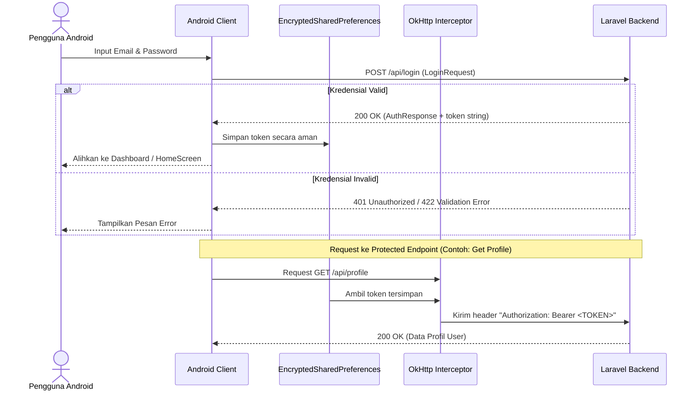

# Android Integration Guide (Panduan Integrasi Android)

Dokumentasi ini dibuat untuk mempermudah **Android Developer** dalam mengintegrasikan aplikasi mobile dengan backend Laravel Community Event Management tanpa harus menelaah source code backend secara langsung.

---

## 1. Lingkungan Pengembangan (Local vs Production)

Untuk menghubungkan aplikasi Android ke server backend Laravel, Anda perlu mengonfigurasi URL dasar (Base URL) untuk Retrofit/OkHttp berdasarkan lingkungan (environment) tempat server berjalan.

### Local Development
Secara default, Laravel berjalan pada port `8000` (menggunakan `php artisan serve`). 
* **Android Emulator (AVD)**: Gunakan alamat IP **`10.0.2.2`** untuk merujuk ke localhost mesin host Anda.
  * Base URL: `http://10.0.2.2:8000/`
* **Perangkat Fisik (Physical Device)**: Hubungkan laptop/PC dan HP ke jaringan Wi-Fi yang sama. Cari IP lokal laptop Anda (misal `192.168.1.50`).
  * Base URL: `http://192.168.1.50:8000/`
  * *Catatan*: Jalankan server Laravel dengan perintah `php artisan serve --host=0.0.0.0 --port=8000` agar server mau menerima request dari luar localhost.
* **Network Security Config**: Mulai dari Android 9 (API 28), HTTP tanpa enkripsi (Cleartext) diblokir secara default. Untuk development lokal, Anda wajib mengizinkan cleartext traffic di `AndroidManifest.xml` atau membuat file `network_security_config.xml`.

### Production
* Gunakan protokol HTTPS yang aman dengan domain server production.
  * Base URL: `https://api.namadomain.com/`

---

## 2. Alur Autentikasi & Penyimpanan Token (Token Lifecycle)

Backend menggunakan **Laravel Sanctum** untuk mengeluarkan token API berbasis teks biasa (*plain text token*). Alur autentikasi pada Android diilustrasikan di bawah ini:



### Penjelasan Langkah Integrasi:
1. **Register**: User mengisi formulir registrasi -> Kirim ke `POST /api/register` -> Mendapatkan token dan objek User baru.
2. **Login**: User mengisi email & password -> Kirim ke `POST /api/login` -> Mendapatkan token dan objek User.
3. **Store Token**: Simpan string token (contoh: `"3|aSdfgh456..."`) ke dalam **`EncryptedSharedPreferences`** milik Android agar aman dari pembacaan memori root.
4. **Attach Token (OkHttp Interceptor)**: Buat sebuah interceptor OkHttp untuk menyisipkan header Authorization secara otomatis pada setiap request yang membutuhkan autentikasi:
   ```kotlin
   class AuthInterceptor(private val context: Context) : Interceptor {
       override fun intercept(chain: Interceptor.Chain): Response {
           val token = TokenManager.getToken(context) // Ambil dari EncryptedSharedPreferences
           val requestBuilder = chain.request().newBuilder()
           
           if (!token.isNullOrEmpty()) {
               requestBuilder.addHeader("Authorization", "Bearer $token")
           }
           
           requestBuilder.addHeader("Accept", "application/json")
           return chain.proceed(requestBuilder.build())
       }
   }
   ```
5. **Logout**: Kirim request `POST /api/logout` ke backend untuk menghapus token di sisi database server, lalu hapus token lokal di Android, kemudian alihkan pengguna kembali ke `LoginScreen`.

---

## 3. Daftar Seluruh Data Transfer Object (DTO)

Model Kotlin di bawah ini dirancang dengan anotasi Gson `@SerializedName` agar siap digunakan untuk parsing JSON.

### A. Core DTOs (Model Inti)

#### 1. UserDto.kt
```kotlin
package com.community.app.data.dto

import com.google.gson.annotations.SerializedName

data class UserDto(
    @SerializedName("id") val id: Long,
    @SerializedName("name") val name: String,
    @SerializedName("email") val email: String,
    @SerializedName("phone_number") val phoneNumber: String?,
    @SerializedName("gender") val gender: String?,
    @SerializedName("bio") val bio: String?,
    @SerializedName("birth_date") val birthDate: String?,
    @SerializedName("avatar_url") val avatarUrl: String?,
    @SerializedName("role") val role: String, // "USER", "ORGANIZER", "ADMIN"
    @SerializedName("is_blocked") val isBlocked: Boolean,
    @SerializedName("is_trusted") val isTrusted: Boolean,
    @SerializedName("created_at") val createdAt: String,
    @SerializedName("updated_at") val updatedAt: String
)
```

#### 2. AuthResponse.kt
```kotlin
package com.community.app.data.dto

import com.google.gson.annotations.SerializedName

data class AuthResponse(
    @SerializedName("user") val user: UserDto,
    @SerializedName("token") val token: String
)
```

#### 3. CategoryDto.kt
```kotlin
package com.community.app.data.dto

import com.google.gson.annotations.SerializedName

data class CategoryDto(
    @SerializedName("id") val id: Long,
    @SerializedName("name") val name: String,
    @SerializedName("icon") val icon: String?,
    @SerializedName("created_at") val createdAt: String?,
    @SerializedName("updated_at") val updatedAt: String?
)
```

#### 4. CommunityDto.kt
```kotlin
package com.community.app.data.dto

import com.google.gson.annotations.SerializedName

data class CommunityDto(
    @SerializedName("id") val id: Long,
    @SerializedName("name") val name: String,
    @SerializedName("organizer_id") val organizerId: Long,
    @SerializedName("category_id") val categoryId: Long,
    @SerializedName("description") val description: String,
    @SerializedName("status") val status: String, // "ACTIVE", "INACTIVE"
    @SerializedName("cover_image_url") val coverImageUrl: String?,
    @SerializedName("member_count") val memberCount: Int,
    @SerializedName("created_at") val createdAt: String,
    @SerializedName("updated_at") val updatedAt: String,
    @SerializedName("organizer") val organizer: UserDto?,
    @SerializedName("category") val category: CategoryDto?,
    @SerializedName("members") val members: List<UserDto>?,
    @SerializedName("events") val events: List<EventDto>?
)
```

#### 5. EventDto.kt
```kotlin
package com.community.app.data.dto

import com.google.gson.annotations.SerializedName

data class EventDto(
    @SerializedName("id") val id: Long,
    @SerializedName("community_id") val communityId: Long,
    @SerializedName("category_id") val categoryId: Long,
    @SerializedName("title") val title: String,
    @SerializedName("description") val description: String,
    @SerializedName("event_date") val eventDate: String, // Format: YYYY-MM-DD
    @SerializedName("event_time") val eventTime: String, // Format: HH:MM:SS / HH:MM
    @SerializedName("location") val location: String,
    @SerializedName("is_online") val isOnline: Boolean,
    @SerializedName("max_attendees") val maxAttendees: Int,
    @SerializedName("attendee_count") val attendeeCount: Int,
    @SerializedName("cover_image_url") val coverImageUrl: String?,
    @SerializedName("status") val status: String, // "UPCOMING", "ONGOING", "PAST"
    @SerializedName("created_at") val createdAt: String,
    @SerializedName("updated_at") val updatedAt: String,
    @SerializedName("community") val community: CommunityDto?,
    @SerializedName("category") val category: CategoryDto?,
    @SerializedName("ratings") val ratings: List<EventRatingDto>?,
    @SerializedName("images") val images: List<EventImageDto>?
)

data class EventImageDto(
    @SerializedName("id") val id: Long,
    @SerializedName("event_id") val eventId: Long,
    @SerializedName("uploaded_by") val uploadedBy: Long?,
    @SerializedName("image_url") val imageUrl: String,
    @SerializedName("created_at") val createdAt: String
)

data class EventRatingDto(
    @SerializedName("id") val id: Long,
    @SerializedName("user_id") val userId: Long,
    @SerializedName("event_id") val eventId: Long,
    @SerializedName("rating") val rating: Int, // 1 to 5
    @SerializedName("comment") val comment: String?,
    @SerializedName("user") val user: UserDto?
)
```

#### 6. NotificationDto.kt
```kotlin
package com.community.app.data.dto

import com.google.gson.annotations.SerializedName

data class NotificationDto(
    @SerializedName("id") val id: Long,
    @SerializedName("user_id") val userId: Long,
    @SerializedName("title") val title: String,
    @SerializedName("message") val message: String,
    @SerializedName("type") val type: String, // "EVENT", "COMMUNITY", "TRUSTED_APPLICATION", "SYSTEM"
    @SerializedName("is_read") val isRead: Boolean,
    @SerializedName("reference_type") val referenceType: String?,
    @SerializedName("reference_id") val referenceId: Long?,
    @SerializedName("created_at") val createdAt: String
)
```

#### 7. ForumMessageDto.kt
```kotlin
package com.community.app.data.dto

import com.google.gson.annotations.SerializedName

data class ForumMessageDto(
    @SerializedName("id") val id: Long,
    @SerializedName("community_id") val communityId: Long,
    @SerializedName("sender_id") val senderId: Long,
    @SerializedName("message") val message: String,
    @SerializedName("created_at") val createdAt: String,
    @SerializedName("sender") val sender: UserDto?
)
```

#### 8. TrustedApplicationDto.kt
```kotlin
package com.community.app.data.dto

import com.google.gson.annotations.SerializedName

data class TrustedApplicationDto(
    @SerializedName("id") val id: Long,
    @SerializedName("user_id") val userId: Long,
    @SerializedName("community_name") val communityName: String,
    @SerializedName("reason") val reason: String,
    @SerializedName("experience") val experience: String?,
    @SerializedName("status") val status: String, // "PENDING", "APPROVED", "REJECTED"
    @SerializedName("reviewed_by") val reviewedBy: Long?,
    @SerializedName("admin_notes") val adminNotes: String?,
    @SerializedName("applied_at") val appliedAt: String,
    @SerializedName("reviewed_at") val reviewedAt: String?,
    @SerializedName("user") val user: UserDto?
)
```

---

### B. Request DTOs (Model Request Body)

#### 1. LoginRequest.kt
```kotlin
package com.community.app.data.dto

import com.google.gson.annotations.SerializedName

data class LoginRequest(
    @SerializedName("email") val email: String,
    @SerializedName("password") val: String
)
```

#### 2. RegisterRequest.kt
```kotlin
package com.community.app.data.dto

import com.google.gson.annotations.SerializedName

data class RegisterRequest(
    @SerializedName("name") val name: String,
    @SerializedName("email") val email: String,
    @SerializedName("password") val: String
)
```

#### 3. CreateCommunityRequest.kt
```kotlin
package com.community.app.data.dto

import com.google.gson.annotations.SerializedName

data class CreateCommunityRequest(
    @SerializedName("name") val name: String,
    @SerializedName("description") val description: String,
    @SerializedName("category_id") val categoryId: Long,
    @SerializedName("cover_image_url") val coverImageUrl: String?
)
```

#### 4. CreateEventRequest.kt
```kotlin
package com.community.app.data.dto

import com.google.gson.annotations.SerializedName

data class CreateEventRequest(
    @SerializedName("community_id") val communityId: Long,
    @SerializedName("category_id") val categoryId: Long,
    @SerializedName("title") val title: String,
    @SerializedName("description") val description: String,
    @SerializedName("event_date") val eventDate: String, // format: YYYY-MM-DD
    @SerializedName("event_time") val eventTime: String, // format: HH:MM
    @SerializedName("location") val location: String,
    @SerializedName("is_online") val isOnline: Boolean,
    @SerializedName("max_attendees") val maxAttendees: Int,
    @SerializedName("cover_image_url") val coverImageUrl: String?
)
```

#### 5. UpdateProfileRequest.kt
```kotlin
package com.community.app.data.dto

import com.google.gson.annotations.SerializedName

data class UpdateProfileRequest(
    @SerializedName("name") val name: String?,
    @SerializedName("phone_number") val phoneNumber: String?,
    @SerializedName("gender") val gender: String?,
    @SerializedName("bio") val bio: String?,
    @SerializedName("birth_date") val birthDate: String? // format: YYYY-MM-DD
)
```

#### 6. ApplyTrustedRequest.kt
```kotlin
package com.community.app.data.dto

import com.google.gson.annotations.SerializedName

data class ApplyTrustedRequest(
    @SerializedName("community_name") val communityName: String,
    @SerializedName("reason") val reason: String,
    @SerializedName("experience") val experience: String?
)
```

---

## 4. Spesifikasi Endpoint Retrofit (Retrofit Interface)

Gunakan pembungkus generik `PaginatedResponse` untuk seluruh endpoint dengan paginasi.

```kotlin
package com.community.app.data.dto

import com.google.gson.annotations.SerializedName

data class PaginatedResponse<T>(
    @SerializedName("current_page") val currentPage: Int,
    @SerializedName("data") val data: List<T>,
    @SerializedName("first_page_url") val firstPageUrl: String,
    @SerializedName("from") val from: Int?,
    @SerializedName("last_page") val lastPage: Int,
    @SerializedName("last_page_url") val lastPageUrl: String,
    @SerializedName("next_page_url") val nextPageUrl: String?,
    @SerializedName("path") val path: String,
    @SerializedName("per_page") val perPage: Int,
    @SerializedName("prev_page_url") val prevPageUrl: String?,
    @SerializedName("to") val to: Int?,
    @SerializedName("total") val total: Int
)
```

### A. Auth API Service
```kotlin
package com.community.app.data.api

import com.community.app.data.dto.*
import retrofit2.Response
import retrofit2.http.Body
import retrofit2.http.GET
import retrofit2.http.POST

interface AuthApiService {
    @POST("api/register")
    suspend fun register(@Body request: RegisterRequest): Response<AuthResponse>

    @POST("api/login")
    suspend fun login(@Body request: LoginRequest): Response<AuthResponse>

    @POST("api/logout")
    suspend fun logout(): Response<Map<String, String>>

    @GET("api/user")
    suspend fun me(): Response<UserDto>

    @POST("api/become-organizer")
    suspend fun becomeOrganizer(): Response<Map<String, Any>>
}
```

### B. Profile API Service
```kotlin
package com.community.app.data.api

import com.community.app.data.dto.*
import okhttp3.MultipartBody
import retrofit2.Response
import retrofit2.http.*

interface ProfileApiService {
    @GET("api/profile")
    suspend fun getProfile(): Response<UserDto>

    @PUT("api/profile")
    suspend fun updateProfile(@Body request: UpdateProfileRequest): Response<Map<String, Any>>

    @Multipart
    @POST("api/profile/avatar")
    suspend fun updateAvatar(
        @Part avatar: MultipartBody.Part
    ): Response<Map<String, Any>>
}
```

### C. Category & Community API Service
```kotlin
package com.community.app.data.api

import com.community.app.data.dto.*
import retrofit2.Response
import retrofit2.http.*

interface CommunityApiService {
    @GET("api/categories")
    suspend fun getCategories(): Response<List<CategoryDto>>

    @GET("api/communities")
    suspend fun getCommunities(
        @Query("search") search: String?,
        @Query("category_id") categoryId: Long?,
        @Query("page") page: Int
    ): Response<PaginatedResponse<CommunityDto>>

    @GET("api/my-communities")
    suspend fun getMyCommunities(
        @Query("page") page: Int
    ): Response<PaginatedResponse<CommunityDto>>

    @GET("api/communities/{id}")
    suspend fun getCommunityDetail(@Path("id") id: Long): Response<CommunityDto>

    @POST("api/communities")
    suspend fun createCommunity(@Body request: CreateCommunityRequest): Response<CommunityDto>

    @PUT("api/communities/{id}")
    suspend fun updateCommunity(
        @Path("id") id: Long,
        @Body request: Map<String, Any>
    ): Response<CommunityDto>

    @DELETE("api/communities/{id}")
    suspend fun deleteCommunity(@Path("id") id: Long): Response<Map<String, String>>

    @POST("api/communities/{id}/join")
    suspend fun joinCommunity(@Path("id") id: Long): Response<Map<String, Any>>

    @POST("api/communities/{id}/leave")
    suspend fun leaveCommunity(@Path("id") id: Long): Response<Map<String, Any>>
}
```

### D. Event API Service
```kotlin
package com.community.app.data.api

import com.community.app.data.dto.*
import okhttp3.MultipartBody
import retrofit2.Response
import retrofit2.http.*

interface EventApiService {
    @GET("api/events")
    suspend fun getEvents(
        @Query("search") search: String?,
        @Query("category_id") categoryId: Long?,
        @Query("status") status: String?,
        @Query("page") page: Int
    ): Response<PaginatedResponse<EventDto>>

    @GET("api/my-events")
    suspend fun getMyEvents(@Query("page") page: Int): Response<PaginatedResponse<EventDto>>

    @GET("api/upcoming-events")
    suspend fun getUpcomingEvents(@Query("page") page: Int): Response<PaginatedResponse<EventDto>>

    @GET("api/recommended-events")
    suspend fun getRecommendedEvents(@Query("page") page: Int): Response<PaginatedResponse<EventDto>>

    @GET("api/events/{id}")
    suspend fun getEventDetail(@Path("id") id: Long): Response<EventDto>

    @POST("api/events")
    suspend fun createEvent(@Body request: CreateEventRequest): Response<EventDto>

    @PUT("api/events/{id}")
    suspend fun updateEvent(
        @Path("id") id: Long,
        @Body request: Map<String, Any>
    ): Response<EventDto>

    @DELETE("api/events/{id}")
    suspend fun deleteEvent(@Path("id") id: Long): Response<Map<String, String>>

    @POST("api/events/{id}/register")
    suspend fun registerEvent(@Path("id") id: Long): Response<Map<String, Any>>

    @POST("api/events/{id}/cancel")
    suspend fun cancelEventRegistration(@Path("id") id: Long): Response<Map<String, Any>>

    @POST("api/events/{id}/ratings")
    suspend fun rateEvent(
        @Path("id") id: Long,
        @Body request: Map<String, Any> // keys: "rating" (Int), "comment" (String?)
    ): Response<EventRatingDto>

    @GET("api/events/{id}/images")
    suspend fun getEventImages(@Path("id") id: Long): Response<List<EventImageDto>>

    @Multipart
    @POST("api/events/{id}/images")
    suspend fun uploadEventImageFile(
        @Path("id") id: Long,
        @Part image: MultipartBody.Part
    ): Response<EventImageDto>

    @POST("api/events/{id}/images")
    suspend fun uploadEventImageUrl(
        @Path("id") id: Long,
        @Body body: Map<String, String> // key: "image_url"
    ): Response<EventImageDto>
}
```

### E. Forum & Chat API Service
```kotlin
package com.community.app.data.api

import com.community.app.data.dto.*
import retrofit2.Response
import retrofit2.http.*

interface ForumApiService {
    @GET("api/communities/{communityId}/messages")
    suspend fun getForumMessages(
        @Path("communityId") communityId: Long,
        @Query("page") page: Int
    ): Response<PaginatedResponse<ForumMessageDto>>

    @POST("api/communities/{communityId}/messages")
    suspend fun sendForumMessage(
        @Path("communityId") communityId: Long,
        @Body body: Map<String, String> // key: "message"
    ): Response<ForumMessageDto>
}
```

### F. Notification API Service
```kotlin
package com.community.app.data.api

import com.community.app.data.dto.*
import retrofit2.Response
import retrofit2.http.*

interface NotificationApiService {
    @GET("api/notifications")
    suspend fun getNotifications(@Query("page") page: Int): Response<PaginatedResponse<NotificationDto>>

    @POST("api/notifications/{id}/read")
    suspend fun markAsRead(@Path("id") id: Long): Response<Map<String, String>>
}
```

### G. Trusted Applications API Service
```kotlin
package com.community.app.data.api

import com.community.app.data.dto.*
import retrofit2.Response
import retrofit2.http.*

interface TrustedApplicationApiService {
    @POST("api/trusted-applications")
    suspend fun applyTrusted(@Body request: ApplyTrustedRequest): Response<TrustedApplicationDto>

    @GET("api/trusted-applications/me")
    suspend fun getMyApplicationStatus(): Response<TrustedApplicationDto>
}
```

### H. Admin API Service
```kotlin
package com.community.app.data.api

import com.community.app.data.dto.*
import retrofit2.Response
import retrofit2.http.*

interface AdminApiService {
    @GET("api/admin/dashboard")
    suspend fun getDashboardStats(): Response<Map<String, Any>>

    @GET("api/admin/users")
    suspend fun getAllUsers(@Query("page") page: Int): Response<PaginatedResponse<UserDto>>

    @POST("api/admin/users/{id}/block")
    suspend fun blockUser(@Path("id") id: Long): Response<Map<String, Any>>

    @POST("api/admin/users/{id}/unblock")
    suspend fun unblockUser(@Path("id") id: Long): Response<Map<String, Any>>

    @GET("api/admin/trusted-applications")
    suspend fun getTrustedApplications(@Query("page") page: Int): Response<PaginatedResponse<TrustedApplicationDto>>

    @POST("api/admin/trusted-applications/{id}/approve")
    suspend fun approveApplication(
        @Path("id") id: Long,
        @Body body: Map<String, String> // key: "admin_notes" (optional)
    ): Response<Map<String, Any>>

    @POST("api/admin/trusted-applications/{id}/reject")
    suspend fun rejectApplication(
        @Path("id") id: Long,
        @Body body: Map<String, String> // key: "admin_notes" (optional)
    ): Response<Map<String, Any>>
}
```

---

## 5. Daftar Repository (Repository Layer)

Android client menggunakan pola repositori (Repository Pattern) untuk membungkus sumber data (Network API) dan mereduksi ketergantungan langsung ke Retrofit interface.

### 1. AuthRepository
Menangani siklus otentikasi akun pengguna.
* **Fungsi**:
  * `suspend fun register(request: RegisterRequest): Result<AuthResponse>`
  * `suspend fun login(request: LoginRequest): Result<AuthResponse>`
  * `suspend fun logout(): Result<Unit>`
  * `suspend fun getMe(): Result<UserDto>`
  * `suspend fun becomeOrganizer(): Result<Unit>`
  * `fun saveToken(token: String)`
  * `fun getToken(): String?`
  * `fun clearToken()`

### 2. CommunityRepository
Mengurus keanggotaan dan pembuatan data komunitas.
* **Fungsi**:
  * `suspend fun getCategories(): Result<List<CategoryDto>>`
  * `suspend fun getCommunities(search: String?, categoryId: Long?, page: Int): Result<PaginatedResponse<CommunityDto>>`
  * `suspend fun getMyCommunities(page: Int): Result<PaginatedResponse<CommunityDto>>`
  * `suspend fun getCommunityDetail(id: Long): Result<CommunityDto>`
  * `suspend fun createCommunity(request: CreateCommunityRequest): Result<CommunityDto>`
  * `suspend fun updateCommunity(id: Long, updateMap: Map<String, Any>): Result<CommunityDto>`
  * `suspend fun deleteCommunity(id: Long): Result<Unit>`
  * `suspend fun joinCommunity(id: Long): Result<Unit>`
  * `suspend fun leaveCommunity(id: Long): Result<Unit>`

### 3. EventRepository
Mengelola pendaftaran, penilaian, dan unggah foto dokumentasi event.
* **Fungsi**:
  * `suspend fun getEvents(search: String?, categoryId: Long?, status: String?, page: Int): Result<PaginatedResponse<EventDto>>`
  * `suspend fun getMyEvents(page: Int): Result<PaginatedResponse<EventDto>>`
  * `suspend fun getUpcomingEvents(page: Int): Result<PaginatedResponse<EventDto>>`
  * `suspend fun getRecommendedEvents(page: Int): Result<PaginatedResponse<EventDto>>`
  * `suspend fun getEventDetail(id: Long): Result<EventDto>`
  * `suspend fun createEvent(request: CreateEventRequest): Result<EventDto>`
  * `suspend fun updateEvent(id: Long, updateMap: Map<String, Any>): Result<EventDto>`
  * `suspend fun deleteEvent(id: Long): Result<Unit>`
  * `suspend fun registerEvent(id: Long): Result<Unit>`
  * `suspend fun cancelEventRegistration(id: Long): Result<Unit>`
  * `suspend fun rateEvent(id: Long, rating: Int, comment: String?): Result<EventRatingDto>`
  * `suspend fun getEventImages(id: Long): Result<List<EventImageDto>>`
  * `suspend fun uploadEventImage(id: Long, imagePart: MultipartBody.Part): Result<EventImageDto>`
  * `suspend fun uploadEventImageUrl(id: Long, url: String): Result<EventImageDto>`

### 4. ProfileRepository
Mengelola informasi profil pengguna terdaftar dan mengunggah gambar profil.
* **Fungsi**:
  * `suspend fun getProfile(): Result<UserDto>`
  * `suspend fun updateProfile(request: UpdateProfileRequest): Result<UserDto>`
  * `suspend fun uploadAvatar(avatarPart: MultipartBody.Part): Result<UserDto>`

### 5. NotificationRepository
Mengakses daftar notifikasi internal dan mengubah status baca.
* **Fungsi**:
  * `suspend fun getNotifications(page: Int): Result<PaginatedResponse<NotificationDto>>`
  * `suspend fun markAsRead(id: Long): Result<Unit>`

### 6. TrustedApplicationRepository
Mengurus permohonan status verifikasi.
* **Fungsi**:
  * `suspend fun applyTrusted(request: ApplyTrustedRequest): Result<TrustedApplicationDto>`
  * `suspend fun getMyApplicationStatus(): Result<TrustedApplicationDto>`

### 7. AdminRepository (Khusus Aplikasi Admin)
Untuk menunjang panel kendali admin platform.
* **Fungsi**:
  * `suspend fun getDashboardStats(): Result<Map<String, Any>>`
  * `suspend fun getAllUsers(page: Int): Result<PaginatedResponse<UserDto>>`
  * `suspend fun blockUser(id: Long): Result<UserDto>`
  * `suspend fun unblockUser(id: Long): Result<UserDto>`
  * `suspend fun getTrustedApplications(page: Int): Result<PaginatedResponse<TrustedApplicationDto>>`
  * `suspend fun approveApplication(id: Long, notes: String?): Result<Unit>`
  * `suspend fun rejectApplication(id: Long, notes: String?): Result<Unit>`

---

## 6. Daftar ViewModel & Alur Pemetaan Data (MVVM Map)

Arsitektur aplikasi Android menggunakan kaidah **Model-View-ViewModel (MVVM)**. Data mengalir dari komponen UI (Screen) ke data source melalui jembatan ViewModel dan Repository.

### Struktur Pemetaan Data (Screen -> ViewModel -> Repository -> API)

```
[Screen / UI Layer]
       ↓ (Observe UI State)
[ViewModel]
       ↓ (Call Business Logic)
[Repository]
       ↓ (Call Network Interface)
[Retrofit API Service]
       ↓ (HTTP Connection)
[Laravel API Server]
```

Berikut adalah daftar ViewModel yang harus Anda buat dan pemetaan detailnya:

| Target Screen / UI | ViewModel | Dependency Repository | API Endpoint |
| :--- | :--- | :--- | :--- |
| **LoginScreen** | `AuthViewModel` | `AuthRepository` | `POST /api/login` |
| **RegisterScreen** | `AuthViewModel` | `AuthRepository` | `POST /api/register` |
| **ProfileScreen** | `ProfileViewModel` | `ProfileRepository`<br>`AuthRepository` | `GET /api/profile`<br>`PUT /api/profile`<br>`POST /api/profile/avatar`<br>`POST /api/logout` |
| **HomeScreen** | `HomeViewModel` | `EventRepository`<br>`CommunityRepository` | `GET /api/upcoming-events`<br>`GET /api/recommended-events`<br>`GET /api/categories` |
| **CommunitySearchScreen** | `CommunityViewModel` | `CommunityRepository` | `GET /api/communities` |
| **CommunityDetailScreen** | `CommunityDetailViewModel` | `CommunityRepository` | `GET /api/communities/{id}`<br>`POST /api/communities/{id}/join`<br>`POST /api/communities/{id}/leave` |
| **CreateCommunityScreen** | `CommunityViewModel` | `CommunityRepository` | `POST /api/communities` |
| **EventDetailScreen** | `EventDetailViewModel` | `EventRepository` | `GET /api/events/{id}`<br>`POST /api/events/{id}/register`<br>`POST /api/events/{id}/cancel`<br>`POST /api/events/{id}/ratings` |
| **CreateEventScreen** | `EventViewModel` | `EventRepository` | `POST /api/events` |
| **EventGalleryScreen** | `EventGalleryViewModel` | `EventRepository` | `GET /api/events/{id}/images`<br>`POST /api/events/{id}/images` |
| **ForumChatScreen** | `ForumViewModel` | `CommunityRepository` | `GET /api/communities/{id}/messages`<br>`POST /api/communities/{id}/messages` |
| **NotificationScreen** | `NotificationViewModel` | `NotificationRepository` | `GET /api/notifications`<br>`POST /api/notifications/{id}/read` |
| **BecomeOrganizerScreen** | `AuthViewModel` | `AuthRepository` | `POST /api/become-organizer` |
| **ApplyTrustedScreen** | `TrustedApplicationViewModel` | `TrustedApplicationRepository` | `POST /api/trusted-applications`<br>`GET /api/trusted-applications/me` |
| **AdminDashboardScreen** | `AdminViewModel` | `AdminRepository` | `GET /api/admin/dashboard` |
| **AdminUserManagementScreen** | `AdminViewModel` | `AdminRepository` | `GET /api/admin/users`<br>`POST /api/admin/users/{id}/block`<br>`POST /api/admin/users/{id}/unblock` |
| **AdminApplicationReviewScreen**| `AdminViewModel` | `AdminRepository` | `GET /api/admin/trusted-applications`<br>`POST /api/admin/trusted-applications/{id}/approve`<br>`POST /api/admin/trusted-applications/{id}/reject` |

---

## 7. Hak Akses Layar Berdasarkan Peran (Role-based Screen Access)

Aplikasi Android wajib memfilter navigasi pengguna berdasarkan peran akun yang dikembalikan dari API profile (`user.role`).

### 1. Peran: USER (Dasar)
Layar yang diizinkan untuk diakses:
* `LoginScreen` & `RegisterScreen`
* `HomeScreen` (Melihat rekomendasi, banner, event terpopuler)
* `ProfileScreen` (Ubah data profil dasar, ganti foto avatar)
* `CommunitySearchScreen` (Mencari komunitas)
* `CommunityDetailScreen` (Melihat data detail komunitas)
* `EventDetailScreen` (Melihat detail event, register, cancel, review rating)
* `ForumChatScreen` (Hanya jika status keanggotaan adalah anggota komunitas)
* `NotificationScreen` (Melihat notifikasi pribadi)
* `BecomeOrganizerScreen` (Form pengajuan peningkatan akun menjadi Organizer)

### 2. Peran: ORGANIZER
Dapat mengakses seluruh layar milik **USER**, ditambah layar:
* `CreateCommunityScreen` (Membuat komunitas baru)
* `ManageCommunityScreen` (Mengubah detail komunitas miliknya)
* `CreateEventScreen` (Membuat event baru di bawah komunitas miliknya)
* `ManageEventScreen` (Mengubah status, kuota, tanggal event miliknya)
* `EventGalleryScreen` (Mengupload foto dokumentasi event)
* `ApplyTrustedScreen` (Form pendaftaran verifikasi program Trusted Organizer)

### 3. Peran: TRUSTED ORGANIZER
Merupakan pengguna dengan role `ORGANIZER` dan memiliki status verifikasi `is_trusted == true`.
Dapat mengakses seluruh layar milik **ORGANIZER**, dengan prioritas tambahan:
* Badge verifikasi centang biru di samping nama Organizer pada UI screen.
* Prioritas penampilan event di `Recommended-events` (Sistem backend otomatis merekomendasikan event terpercaya).

### 4. Peran: ADMIN
Dapat mengakses dashboard administrator platform (dapat dibuat di aplikasi terpisah atau disembunyikan di menu khusus):
* `AdminDashboardScreen` (Grafik statistik pertumbuhan data global)
* `AdminUserManagementScreen` (List pengguna platform, tombol blokir, tombol lepas blokir)
* `AdminApplicationReviewScreen` (Daftar verifikasi organizer, detail portofolio, input catatan admin, tombol approve, tombol reject)
* *Catatan*: Admin secara implisit memiliki hak untuk memodifikasi/menghapus komunitas/event apa saja di platform.

---

## 8. Status Kesiapan Fitur (Feature Checklist)

Berikut adalah status kesiapan integrasi Android Client dengan Server Backend Laravel:

* [x] **Konektivitas Dasar & Environment API** (`✓ Endpoint tersedia`)
* [x] **Autentikasi & Authorization Bearer Header** (`✓ Endpoint tersedia`)
* [x] **Data Transfer Object (DTO) Kotlin Models** (`✓ DTO tersedia` - terdefinisi lengkap di dokumen ini)
* [x] **Konfigurasi Kelas Retrofit Service** (`✓ Retrofit tersedia` - kode interface siap salin)
* [x] **Abstraksi Repository Layer** (`✓ Repository tersedia` - daftar method dan tipe return siap pakai)
* [x] **Arsitektur Model-View-ViewModel (MVVM)** (`✓ Repository tersedia`)
* [ ] **Implementasi Layout UI XML/Jetpack Compose** (`⚠ Belum dibuat` - Tanggung jawab Android Client)
* [ ] **Konfigurasi Dependency Injection Hilt/Koin** (`⚠ Belum dibuat` - Tanggung jawab Android Client)
* [ ] **Implementasi Database Local Caching Room** (`⚠ Belum dibuat` - Opsional pada Android Client)
* [ ] **Integrasi Firebase Cloud Messaging (FCM) Push Notifications** (`⚠ Belum dibuat` - Perlu registrasi API key FCM)
